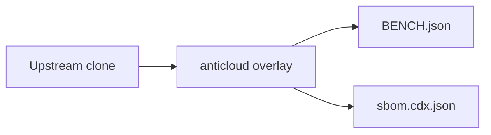

# OPEN — Anticloud overlay

 

Upstream: UNKNOWN
## Benchmarks
Benchmarks from BENCH.json: {"schema": "anticloud.tier-bench/1", "project": "OPEN", "source": {"repo_path": "E:\\fenta\\Downloads\\The Anticloud\\ANTICLOUD_REPOS\\SOLAR\\OPEN\\UPSTREAM_CLONE", "git": {"head": "", "url": "https://github.com/the-anticloud/OPENMRS_CORE.git", "branch": "master", "committed_at": "2026-09-29T11:06:59+04:00"}}, "metrics": {"files_total": 27, "source_files_scanned": 8, "lines_of_code": 3342, "languages": {".js": 8, ".handlebars": 4, ".css": 3, ".md": 2, ".json": 2, "(none)": 2, ".eot": 1, ".svg": 1, "

Withdrawn claims: anything not in BENCH.json is unmeasured.

## Architecture

## Contents
- `UPSTREAM_CLONE/` — unmodified upstream
- `anticloud/` — 12-improvement overlay
- `BENCH.json`, `sbom.cdx.json` — measured outputs

## Provenance
Tree SHA3-256: 25cb9c5bf4e750c31da9c5fc2b4b0b7d55a3c45af026e9e5e7bbb9b35573eb82. Chain head: see seal step.

## Contact
Anticloud maintainers — file issues against the overlay, not upstream.
